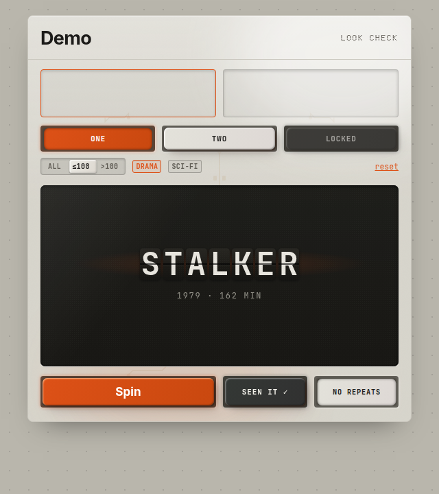

# Videomat — handover på looken

Alt du trenger for å ta med utseendet og følelsen fra Videomat inn i et annet
prosjekt. Kildekoden ligger i `src/`; en portabel, app-uavhengig kopi av de
gjenbrukbare delene ligger i `docs/look/`.



*Skjermbildet over er `docs/look/demo.jsx` — bygget utelukkende av filene i
`docs/look/`, uten en linje fra `src/`. Det er samtidig røyktesten på at
uttrekket står på egne bein.*

---

## 1. Hva looken er

Ett fysisk apparat på skjermen. Ikke et nettsted som ser ut som et apparat —
et apparat. Fire referanser er blandet med vilje:

| Referanse | Hva den bidrar med |
| --- | --- |
| **Braun / Dieter Rams** | Paletten (varm grå plast + én oransje), rolige grid, ingen dekor |
| **Teenage Engineering** | Tastene: mørk socket, gradient-cap, taktilt trykk |
| **Transparent Game Boy («clear tech»)** | Frostet halvgjennomsiktig skall med PCB-spor og lysdiffusjon under |
| **Nothing** | Dot-matrix-mikroetiketter (Doto) og registreringsprikkene på flaten rundt |
| **Solari avgangstavle** | Split-flap-displayet — resultatet *ankommer*, det vises ikke |

Fem regler holder det sammen. Bryter du dem forsvinner effekten fortere enn du tror:

1. **Én aksentfarge.** `#DD5117` er hele fargebudsjettet. Alt annet er gråtoner
   i panelet eller på displayet. (Videomat har grønn og blå i tillegg, men bare
   fordi de er *lånt utenfra* — Letterboxds egne fargekoder for A/B/overlapp.
   Uten en slik ekstern grunn: hold deg til én.)
2. **Fast høyde.** Maskinen vokser aldri. Detaljer bor på baksiden av felter
   som flipper, ikke i seksjoner som dyttes inn. Meldinger som kommer og går
   får en stripe med `min-height`. Ingenting hopper.
3. **Alt reagerer fysisk.** Hver trykkflate synker inn. Landinger klunker og
   vibrerer. En knapp som ikke gjør noe, er en knapp som er ødelagt.
4. **Bevegelse er kort og mekanisk.** 100–320 ms, `cubic-bezier`-easings som
   stopper hardt. Ingenting glir eller fader inn over et halvsekund.
5. **Displayet er maskinens eneste stemme.** Feil, hint, tomtilstander og
   onboarding står i displayet med dot-matrix-font — ikke som toasts eller
   modaler et annet sted i grensesnittet.

---

## 2. Hva du kopierer

```
docs/look/
  videomat-look.css   ← tokens + alle klassene. Start her.
  Key.jsx             ← TE-tasten (byggeklossen for alle trykkflater)
  SplitFlap.jsx       ← Solari-displayet, uten avhengigheter
  CircuitLayer.jsx    ← PCB-sporene som måler seg mot faktiske paneler
  sound.js            ← syntetisk maskinlyd, ingen lydfiler
  demo.jsx            ← minimal maskin som bruker alt over (referanse + røyktest)
public/fonts/*.woff2  ← de sju fontfilene (Inter, JetBrains Mono, Doto)
```

Vil du se det kjøre før du bygger noe: bundle `demo.jsx` (esbuild eller Vite),
legg `videomat-look.css` og en `fonts/`-mappe ved siden av, og server mappa.
Fontene må ligge på `/fonts/…` slik `@font-face`-reglene peker.

Minimums-oppsett i et nytt React-prosjekt:

```jsx
import "./videomat-look.css";
import Key from "./Key";
import SplitFlapDisplay from "./SplitFlap";

<div className="page">
  <main className="machine">
    <div className="light-blob warm" aria-hidden="true" />
    <div className="light-blob cool" aria-hidden="true" />
    <div className="frost" />
    <div className="machine-gloss" />
    <div style={{ position: "relative", zIndex: 1 }}>
      {/* alt innhold her */}
    </div>
  </main>
</div>
```

Looken er ren CSS + fire små React-filer. Ingen Tailwind, ingen UI-bibliotek,
ingen animasjonsbibliotek. Vil du bruke Vue/Svelte/vanilla: CSS-en er
uendret gjenbrukbar, og de fire komponentene er ~150 linjer hver å skrive om.

---

## 3. Tokens

Definert i `:root` i `videomat-look.css`. I Videomat er de **duplisert som
JS-konstanter øverst i `App.jsx`** (`INK`, `PANEL`, `RED`…) fordi mye styling
er inline. Endrer du i CSS, endre begge steder — eller enda bedre, dropp
duplikatet i det nye prosjektet og les `var(--…)` overalt.

### Farger

| Token | Verdi | Rolle |
| --- | --- | --- |
| `--red` | `#DD5117` | Braun-oransje. Primærhandling + eneste aksent |
| `--error` | `#A8321A` | Feiltekst — mørkere for AA-kontrast på panelet |
| `--ink` | `#1C1B19` | Tekst, mørke flater, «ink»-taster |
| `--panel` | `#DDDAD2` | Kabinettplasten |
| `--panel-hi` | `#E9E7E0` | Hevede flater, baksider av flip-kort |
| `--panel-lo` | `#C9C6BD` | Kantlinjer og skiller |
| `--page-bg` | `#B9B6AC` | Bordet maskinen står på |
| `--dim` | `#5D5A52` | Sekundærtekst på panel (≥4.5:1) |
| `--d-hi` / `--d-mid` / `--d-label` | `#9A988F` / `#8F8D84` / `#8A8880` | Tre gråtoner **på** det mørke displayet, alle ≥4.5:1 mot `--ink` |

Displaygråtonene er ikke tilfeldige — de er de mørkeste verdiene som fortsatt
klarer 4.5:1 på `#1A1916`. Går du mørkere for stemningens skyld, ryker
kontrastkravet.

### Typografi — tre roller, aldri flere

| Rolle | Stack | Brukes til |
| --- | --- | --- |
| **GROTESK** | `"Helvetica Neue", "Inter", Helvetica, Arial, sans-serif` | Titler, filmnavn, modusknapper, brødtekst |
| **MONO** | `"SF Mono", "JetBrains Mono", ui-monospace, Menlo, Consolas, monospace` | Etiketter, tellere, statuslinjer, data |
| **DOT** | `"Doto", "JetBrains Mono", ui-monospace, monospace` | KUN korte VERSAL-mikroetiketter |

Systemfonten står først i to av tre stacks med vilje: Mac/iOS får Helvetica
Neue og SF Mono gratis, resten får de self-hostede. Doto lastes alltid.

**Doto er en punktfont og krever disiplin:** vekt 900, minst 11px, og
`letter-spacing` 0.10–0.18em. Under det blir den mønster, ikke tekst. Bruk den
aldri til noe lengre enn en kort etikett. Klassen `.dotlabel` har defaultene.

### Easings

```css
--ease-out:    cubic-bezier(0.23, 1, 0.32, 1);      /* landinger, innfading  */
--ease-in-out: cubic-bezier(0.77, 0, 0.175, 1);     /* flip-rotasjon         */
--ease-in:     cubic-bezier(0.55, 0.06, 0.68, 0.19);/* fold-ned på flappen   */
```

---

## 4. Kabinettet — lag for lag

`.machine` er en `position: relative`-boks med `overflow: hidden`, maks 560px
bred. Fem lag stables i denne rekkefølgen, alle `pointer-events: none`:

1. **`<CircuitLayer />`** — kobberspor, `opacity: 0.12`, `mix-blend-mode: multiply`
2. **`.light-blob warm`** — 340×220px oransje `blur(40px)` nede til venstre
3. **`.light-blob cool`** — 320×250px hvit `blur(40px)` oppe til høyre
4. **`.frost`** — SVG-turbulens som data-URI, `opacity: 0.045`, `overlay`
5. **`.machine-gloss`** — hvit gradient over øverste 46 %

Deretter **alt innhold i én `<div style={{position:"relative", zIndex:1}}>`.**
Glemmer du den wrapperen forsvinner innholdet under frosten.

Selve plasten er `rgba(221,218,210,0.82)` + `backdrop-filter: blur(10px)` bak
en `@supports`-guard, med `--panel` i solid som fallback. Det er
gjennomsiktigheten som gjør at prikkegriden på `.page` skimtes gjennom skallet
— den detaljen bærer hele «clear tech»-følelsen.

### PCB-laget er ikke tapet

`CircuitLayer` måler de faktiske panelene med `getBoundingClientRect()` og
ruter ortogonale spor med 45°-avfasede knekk mellom dem, i **signalrekkefølge**
— inngangene → valget → displayet → utløseren. Vias (sirkler) sitter der et
spor forlater et felt, SMD-pads sitter ved display-inngangen. En
`ResizeObserver` tegner om ved hver layoutendring.

I det nye prosjektet: gi feltene dine stabile selectorer og send dem inn som
`nodes`-arrayet i signalrekkefølge. Feiler en måling (et felt finnes ikke i
gjeldende tilstand), tegner laget ingenting i stedet for noe feil.

---

## 5. Tasten

Byggeklossen for **alle** trykkflater. Anatomien:

- **Socket** (`.key`): `#46433C`, `border-radius: 4px`. Duset varm mørkgrå —
  aldri ren svart.
- **Cap** (`.key .cap`): `margin: 3px` inne i socketen, `border-radius: 7px`
  (større enn socketens 4px — det er det som gjør at capen leses som et separat
  stykke plast), `linear-gradient(117deg, var(--cap), var(--cap2))`.
- **Fem skygger** på capen samtidig: to inset (høylys øverst-venstre, skygge
  nederst-høyre) og tre slagskygger i økende radius. Det er skyggestabelen som
  gir høyden.
- **Trykk** (`:active` eller `.on`): capen flytter seg 0.5px, skalerer til 0.98,
  og **alle skyggene erstattes av én mørk inset-ring**. Ingen layout endres.
- **`::before`** legger cap-fargen som en 1px `blur(2px)`-kant på socketen —
  fargen «reflekteres» i brønnveggene.
- **`::after`** er en usynlig `inset: -6px`-flate: capene er ~30px, tommelen
  trenger 44px.

Fargene settes med fire custom properties (`--cap`, `--cap2`, `--hl`,
`--captext`) fra `KEY_COLORS` i `Key.jsx`. Vil du lage en ny hette, trenger du
alle fire — særlig `--hl`, som er høylyset og må være en lys, mettet versjon av
hovedfargen (ikke hvit).

**`.on` er latched, ikke hover.** En tast som står nede betyr «denne
innstillingen er på». Den følelsen er halve looken — bruk den til togglene dine.

**Låst ≠ disabled.** Er noe utilgjengelig fordi brukeren mangler et steg, bruk
`aria-disabled` + `className="locked"` og la klikket forklare seg (i displayet).
`disabled` er bare for det som er ekte umulig. `.locked` desaturerer capen men
beholder trykk-animasjonen, så trykket kvitteres ærlig.

---

## 6. Displayet

`.display-module` er en nedsenket LCD:

- `background: #1A1916`, tre skygger: dyp inset (fordypning i housingen),
  1px inset kant, og en 1px hvit linje under (kanten på utfresingen).
- `::before` legger screen-door: 3×3px radial-gradient-prikker + en svak
  grønngrå skjermtone.
- `::after` legger et diagonalt glasshøylys fra øverst venstre.

Begge pseudoelementene har `z-index: 2`, så **alt innhold må ligge over dem**.
I `videomat-look.css` gjør `.display-module > * { position: relative; z-index: 1 }`
det automatisk; i Videomats egen kode står `zIndex: 1` inline på hvert element.

Alt maskinen har å si står her, i DOT-fonten: `READY · PRESS SPIN`,
`SEARCHING… 12 CHECKED`, `NO MATCH — LOOSEN FILTERS`, `ADD LIST B TO UNLOCK`.
Også onboardingen (tre nummererte steg) bor i displayet. Ingen tomtilstand
noe annet sted. `.searching` pulser opasiteten mens maskinen jobber.

---

## 7. Split-flappen

Ekte Solari-mekanikk, ikke en tekstanimasjon:

- Hvert tegn er et kort delt på midten. Samme glyph rendres i begge halvdeler
  og klippes — derfor går sømmen *gjennom* bokstaven, ikke mellom to bokstaver.
- Ved bytte folder **øvre halvdel av det gamle tegnet ned** (130 ms), så folder
  **nedre halvdel av det nye tegnet opp** (130 ms, 120 ms forsinket).
- `.flap-seam` er den fysiske spalten: mørk linje med inset-skygge og en
  hårtynn hvit refleks under.
- Kortene lander venstre→høyre, 62 ms mellom hvert, så raden «ruller».
- Landet resultat får `.landed`: en oransje radial bloom bak tegnene (baklyst
  segment) og litt lysere glyffarge.

Tre ting å vite når du gjenbruker den:

1. **Komponenten eier timingen.** Du setter `spinning` og bumper `spinKey`;
   den kaller `onSettle` når raden har roet seg. Ikke prøv å time landingen
   utenfra med egne `setTimeout` — de to glipper garantert fra hverandre.
2. **Auto-skalering måler `grid`, ikke `text`.** Gridet ligger ett steg bak
   ved et nytt spinn, og måler du på det gamle (kortere) innholdet får du
   `scale: 1` som aldri korrigeres → lang tekst flyter ut av displayet. Under
   `MIN_SCALE = 0.34` brytes teksten heller i to balanserte linjer.
3. **Én rAF-driver, ett `setGrid` per takt.** Kortene er `React.memo`, så bare
   celler som faktisk byttet tegn re-rendres. Tjue individuelle timere ville
   drept mobilen.

Alle mål er i `em` og styres av `font-size` på `.flap-scaler` (46px normalt,
26px med `compact`). `delay`-propen forskyver hele løpet — Videomat gir det
andre duell-vinduet 520 ms så det lander sist. Det er ren dramaturgi og verdt
å stjele.

---

## 8. Flip-kortet — «snu arket»

Mønsteret som gjør at maskinen aldri vokser: et felt roterer 180° og viser sin
egen bakside. Brukes til tre ting i Videomat — listeinnmating, filmdetaljer,
duell-detaljer — med nøyaktig samme mekanikk.

```html
<div class="flipbox flipped" style="height: 264px">
  <div class="flip-inner">
    <div class="flip-face"><!-- forside --></div>
    <div class="flip-face flip-back"><!-- bakside --></div>
  </div>
</div>
```

Tre feller, alle brent på i Videomat:

- **Aldri `overflow: hidden` på `.flip-inner` eller `.flip-face`.** Det flater
  ut 3D-konteksten og skrur av `backface-visibility` i Chrome — begge sidene
  vises samtidig. Trenger du klipping: legg en indre `position: absolute;
  inset: 0; overflow: hidden`-wrapper inni facen.
- **Sett fast høyde på `.flipbox`.** Sidene er `position: absolute` og har
  ingen egen høyde.
- **Håndter fokus.** Baksiden finnes i DOM-en hele tiden. Sett `tabIndex={-1}`
  på alt på den skjulte siden og `aria-hidden` på facen, ellers taber brukeren
  inn i usynlig innhold.

Escape lukker (flipper tilbake), og fokus flyttes inn på ✕-tasten ~340 ms
etter flippen (når rotasjonen er ferdig) og tilbake til utløseren ved lukking.

---

## 9. De små kontrollene

**Tri-switch** (`.tri-switch`) — trefase-bryter: mørk brønn, glidende knott med
samme plastgradient som tastecapen, bare flatere. Knotten posisjoneres med
`transform: translateX(pos * 100%)` og `width: calc((100% - 4px) / 3)`. Bruk
`role="radiogroup"` + `role="radio"` + `aria-checked`. Skalerer til N faser ved
å endre divisoren.

**Chips** (`.chip`) — passive i panelets gråtoner, valgt = den ene oransjen med
`border-color`, tekstfarge og 9 % bakgrunn. `aria-pressed`. I Videomat ligger de
i et `grid-auto-rows: minmax(24px, 1fr)`-rutenett som fyller panelhøyden, så
radene strekker seg i stedet for å scrolle.

**Toast** (`.toast` i `src/index.css`) — `position: absolute` over bunnraden.
Flyter alltid, dytter aldri. Regel 2.

---

## 10. Lyd og haptikk

`sound.js` syntetiserer alt med Web Audio — **ingen lydfiler**. `AudioContext`
lages først ved første lyd (nettleseren krever uansett en brukerhandling).

| Funksjon | Lyd |
| --- | --- |
| `tick()` | 2100 Hz, 30 ms — mekanisk klikk per steg |
| `clunk()` | 150 Hz square + 70 Hz sine — fysisk landing |
| `win()` | 523 → 784 Hz triangle — liten fanfare |
| `flapClack()` | 2 oscillatorer: kropp ~300 Hz + kant 1650 Hz |

`flapClack` er den lærerike: en hel rad flakser samtidig, så pitch og gain
randomiseres ±3 % per kort (ellers blir det robotisk), og lyden strupes til
~1 klakk per 22 ms (ellers maskingevær-klipper 20 kort lydutgangen). Klakken
tynnes naturlig ut når raden roer seg.

**Lyd er av som default** og har en egen tast i headeren. Alt er pakket i
`try/catch` — lyd er pynt, aldri en feilkilde.

Haptikk følger lyden: `navigator.vibrate([26,30,22])` på landing, `8` per
tie-break-steg, `[40,50,90]` på vinner. iOS støtter ikke `vibrate` — et stille
nei er riktig svar, så det er også pakket i `try/catch`.

---

## 11. Tilgjengelighet og respons

Dette er ikke pynt oppå looken — det er forutsetninger for at den fungerer.

- **44px treffflater overalt.** Løst uten layout-skift: `.key::after
  { inset: -6px }`, og `padding: 12px; margin: -12px` på tekstlenker
  (`.linkbtn`, `.bypart`).
- **Hover kun på ekte pekere.** Alt hover-stell står i
  `@media (hover: hover) and (pointer: fine)` — ellers henger hover-tilstanden
  igjen etter tap på mobil.
- **`prefers-reduced-motion`** respekteres tre steder: transitions skrus av,
  flap-animasjonen kortes til 0.001 s, og *selve spinnet hoppes over* i logikken
  (resultatet settes direkte med et clunk). En bruker som ber om mindre bevegelse
  skal ikke sitte gjennom et 2-sekunders flap-løp.
- **Fokus** er `2px solid var(--red)` med `offset: 2px` på `:focus-visible`.
- **Kontrast:** hver gråtone i tabellen i avsnitt 3 er valgt for å klare 4.5:1
  mot sin egen bakgrunn. `--error` finnes bare fordi `--red` ikke klarer det som
  tekst på panelet.
- **`aria-live="polite"`** på en visuelt skjult div annonserer resultatet —
  split-flappen selv er `aria-hidden` (den er en animasjon, ikke tekst).
- **Brytepunkt: 520px.** Under det klemmes displayet med
  `clamp(200px, calc(100dvh - 464px), 264px)` så hele maskinen står uten scroll.
  `100vh` står som fallback rett før `100dvh` — eldre nettlesere trenger den.
- **`env(safe-area-inset-*)`** på `.page` for standalone PWA.

---

## 12. Sjekkliste når du bygger noe nytt i denne looken

- [ ] Font-filene kopiert til `public/fonts/`, `@font-face` med i CSS-en
- [ ] `.page` på ytterste div, `.machine` på selve apparatet
- [ ] De fem kabinettlagene lagt inn, innhold i `position:relative; zIndex:1`-wrapper
- [ ] Hver seksjon har fast eller `min-height`-låst høyde — ingenting hopper
- [ ] Alle trykkflater er `<Key>`; togglene bruker `.on`, ikke hover
- [ ] Alt maskinen «sier» står i displayet, i DOT-font, VERSALER
- [ ] Én aksentfarge i hele grensesnittet
- [ ] `prefers-reduced-motion` hopper over animasjonene *i logikken*, ikke bare i CSS
- [ ] Lyd default av, bak en tast, pakket i `try/catch`
- [ ] Tabbet gjennom hele greia: ingen fokus på baksiden av et flip-kort

---

## 13. Filkart i kildeprosjektet

| Fil | Innhold |
| --- | --- |
| `src/index.css` | Alle klassene, fonter, tokens (846 linjer, kommentert) |
| `src/App.jsx` | `Key`, `FlipSlot`, `DetailsBack`, `FilterPanel`, `DuelWindow`, `CircuitLayer`, JS-fargekonstanter, GRID-REGLER-kommentaren (linje ~1233) |
| `src/SplitFlap.jsx` | Solari-displayet |
| `src/lib/sound.js` | Syntetisk maskinlyd |
| `public/fonts/` | Sju woff2-filer |
| `index.html` | `theme-color: #B9B6AC`, PWA-meta |
| `docs/look/` | Portabelt uttrekk av alt over — det du kopierer |

`src/lib/letterboxd.js`, `src/lib/storage.js` og `api/` er ren Videomat-logikk
(watchlist-henting, CSV-parsing, localStorage, rate limiting) og har ingenting
med looken å gjøre.
